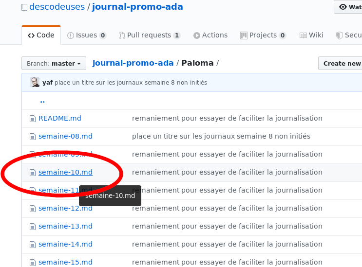
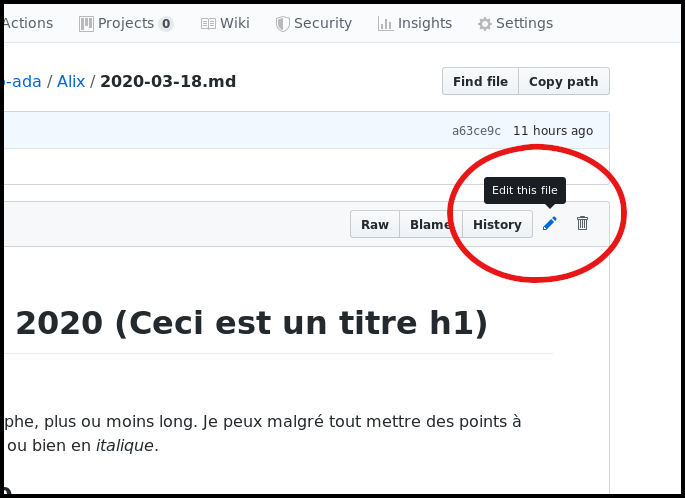
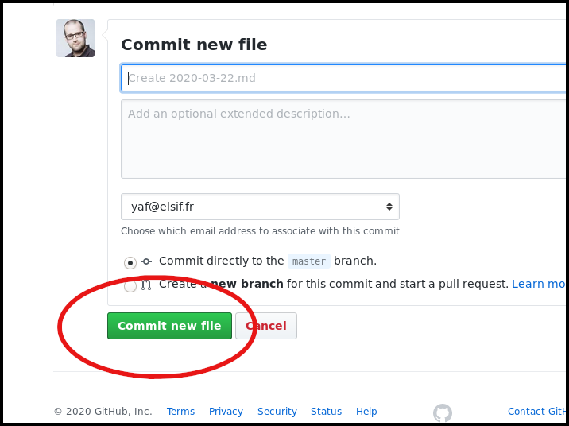

# Formation de la promo Ada Lovelace

Vous trouverez ici toutes les informations autour de la formation des descodeuses de la promotion Ada Lovelace.

- [Comment faire son journal ?](#comment-faire-son-journal-)
- [Quelle contenu dans mon journal ?](#quelle-contenu-dans-mon-journal-)
- [Journal des cours](cours/README.md)
- [Journal d'Alix](Alix/)
- [Journal d'Aycha](Aycha/)
- [Journal de Céline](Celine/)
- [Journal de Charlotte](Charlotte/)
- [Journal de Delphine](Delphine/)
- [Journal de Françoise](Francoise/)
- [Journal de Laura](Laura/)
- [Journal de Lynda](Lynda/)
- [Journal de Nassima](Nassima/)
- [Journal de Paloma](Paloma/)
- [Journal de Sarah](Sarah/)
- [Journal de Silvia](Silvia/)
- [Journal de Sophie](Sophie/)
- [Journal de Soraya](Soraya/)
- [Journal de Vanessa](Vanessa/)

## Pourquoi faire ?

Un journal apporte plusieurs choses intéressantes dans le cadre d'une formation :

- prendre du recul sur ce que vous avez appris;
- avoir un contenu personnalisé en fin de formation;
- avoir un pense-bête listant des commandes ou des liens utiles;
- avoir un outil de suivi pour les personnes encadrantes;
- partager vos apprentissages avec les autres stagiaires;

C'est pour toutes ces raisons que nous vous aiderons à prendre le temps, chaque jour, pour écrire, noter ce que vous avez appris, découvert. Vous pouvez également noter des questions, des points que vous n'avez pas compris, des points que vous aimeriez explorer ou eclaircir.

## Comment faire son journal ?

Nous vous proposons :
- d'écrire votre journal quotidien dans un format texte, si possible en [markdown](https://fr.wikipedia.org/wiki/Markdown) (le [cours markdown d'OpenClassRoom](https://openclassrooms.com/fr/courses/1304236-redigez-en-markdown));
- sur un dépot [github/descodeuses/journal-promo-ada](https://github.com/descodeuses/journal-promo-ada)
- le contenu est publié sur [descodeuses.github.io/journal-promo-ada/](https://descodeuses.github.io/journal-promo-ada/)

Si vous avez des difficultés, prévenez nous tout de suite ! nous sommes là ! pour vous !

Pour écrire votre journal, le plus simple, c'est directement dans github.

- aller sur [github.com/descodeuses/journal-promo-ada/](https://github.com/descodeuses/journal-promo-ada/)
- clicker sur le répertoire qui porte votre prénom
- clicker sur le fichier qui correspond à la semaine en cours

- appuyer sur l'icône crayon en haut à droite du fichier

- écrivez votre journal comme vous le voulez (en ajoutant une séparation, un sous titre pour le jour, ou bien autrement)

- une fois terminé, vous pouvez aller en bas de la page et clicker sur le bouton « commit »

That's all !

## Quelle contenu dans mon journal ?

La question qui dois vous animer au moment d'écrire dans votre journal est **qu'est-ce que j'ai appris aujourd'hui ?**.

Chaque action découverte, explorée, esssayée, est importante. **Il n'y a pas de petit apprentissage**.

Écrivez tout ce que vous voulez :

- des commandes utiles
- des nouveaux outils  (mettez les liens vers la page de l'outil)
- une ou plusieurs lignes de code que vous trouvez vraiment chouette
- une ou plusieurs lignes de code que vous ne comprenez pas
- une copie d'écran d'une de vos page web qui n'est pas jolie
- une copie d'écran d'une de vos pages web qui est vraiment très chouette
- une astuce
- un cours
- un tuto
- une chaine youtube
- une video
- un exercice
- une question
- une reflexion
- ...

sous la forme que vous voulez

- une liste de mots, de liens
- des paragraphes de textes
- des photos de notes (attention à l'insertion d'image dans markdown ;-))
- un dessin (idem que pour les photos)
- du code
- ...

