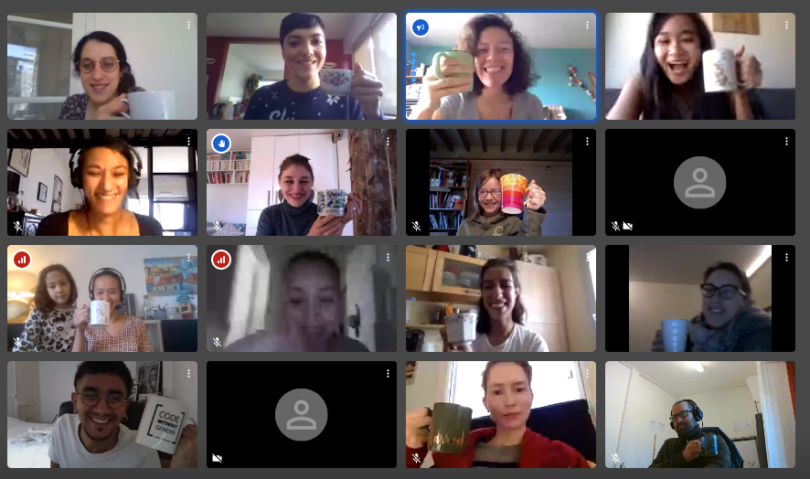

# 8eme semaine

## Lundi 23 mars

Journée sur les projets Codevore. Le rendu est pour le 30, dans la journée.

### Café-confiné !

C'était le premier café confiné toutes ensemble !

### Identiation, code propre, éditeur

Petite visio avec Alix pour un soucis avec du CSS. C'est finalement une
histoire d'accolade mal fermée. Avoir un code bien indenté permet de visualiser
rapidement ce genre de soucis. Quand on connait bien son éditeur, c'est aussi
possible d'avoir de l'aide. Charlotte vante les mérie de
[Brackets](http://brackets.io/). C'est effectivement un bon éditeur, mais il se
limite au techno du navigateur il me semble.

### Responsive Web Design avec Helvira

Helvira propose [un cours](semaine-08/liens-cours-RWD.docx) et se rends
disponible pour discuter autour du responsive design.

Je reproduis ici le contenu du fichier de cours de Helvira.

- Ressources
    1. [C’est quoi le responsive web design ?](https://www.alsacreations.com/article/lire/1615-cest-quoi-le-responsive-web-design.html)
    2. [Les différentes tailles des écrans de device](http://mydevice.io/devices/)
    3. [Principes de base de la conception de sites web adaptatifs](https://developers.google.com/web/fundamentals/design-and-ux/responsive)
    4. [Les Media Queries en CSS3](https://www.alsacreations.com/article/lire/930-css3-media-queries.html)
    
- Aller plus loin
    1. [Les Media Queries](https://developer.mozilla.org/fr/docs/Web/CSS/Requ%C3%AAtes_m%C3%A9dia/Utiliser_les_Media_queries)
    2. [Choisir la taille de police et l’unité](http://www.pompage.net/traduction/dimensionner-ses-fontes-avec-rem)
    3. [Les préfixes vendeurs en CSS](https://www.alsacreations.com/article/lire/1159-prefixes-vendeurs-css-proprietaires.html)
    4. [Différentes vues (smartphone, tablette, desktop) de sites internet](https://mediaqueri.es/)

### Débordement ou point de fuite

En soirée, rapide visio avec Laura pour un problème sur du HTML/CSS. En HTML,
si l'on contraint le contenant en largeur et en hauteur, sans préciser comment
doit se comporter le contenu, c'est probable qu'il dépasse et crée une sorte de
bousculade dans les éléments qui vont suivre. 

C'est une bonne chose de préciser comment le contenu dois se comporter avec
l'attribut overflow (`hidden`, `scroll`, ...).

L'autre possibilité, c'est de laisser un point de fuite. Soit le contenant
s'étale en largeur, soit en hauteur. Le classique, c'est en hauteur (le scoll
vertical est souvent préférable au scroll horizontal). On limite assez rarement
la hauteur.

## Mardi 24 mars

Encore un petit café ce matin. Ça fait du bien de se voir, de pouvoir parler, rigoler, se tenir au courant, se motiver.

Un échange avec Céline m'apprend qu'elle voyait le journal comme une contrainte de plus, et qu'après l'avoir fait, il y vois un intérêt. C'est un moment qui permet de prendre du recul sur les apprentissagess frais, c'est un processus pédagogique qui aide à ancrer les connaissances.

Un petit coup de main à Alis pour intégrer les nouvelles dans son site.
- Le fichier de données était chargé après le code qui l'utilise;
- La liste était attaché au body (et donc, on ne sais pas trop où sur la page);
- Le css rendait les liens invisible (parce que de la même couleur que le fond).

Sur le dernier point, Alix c'est débrouillée seule.

Discussion avec Françoise pour retrouver les cours de Helvira. Nous en profitons pour mettre le contenu du doc dans la page, directement. Il manque la présentation utilisé par Hevira ?

Nous n'arrivons pas à travailler sur l'aspect git/github avec Françoise (problème de connexion). Françoise se demande comment mettre en place un repo sur un projet existant.

Reprise des journaux pour qu'ils soient tous à la semaine. Un fichier par jour, ça faisait beaucoup. Là en plus, chaque fichier a pu être préparé à l'avance. La procédure est donc simplifié : il faut mettre à jour un fichier existant.
