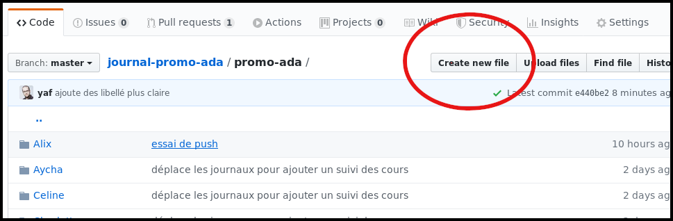
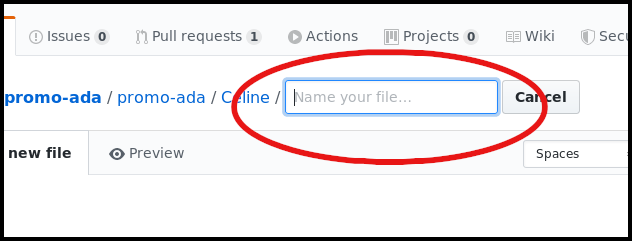
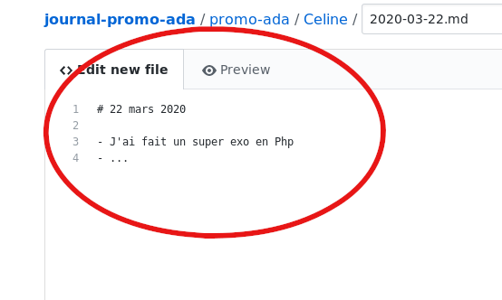
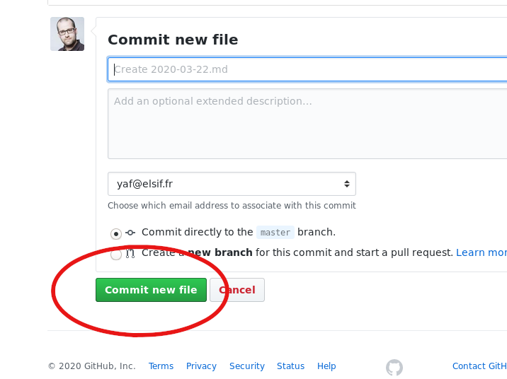
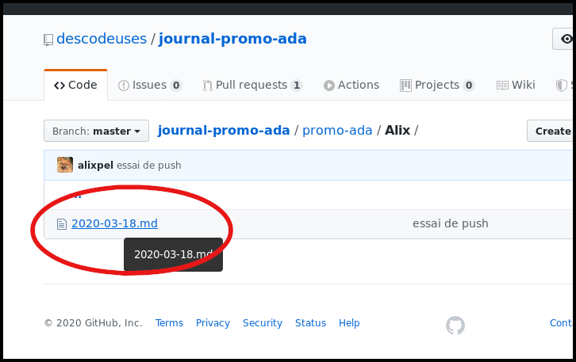
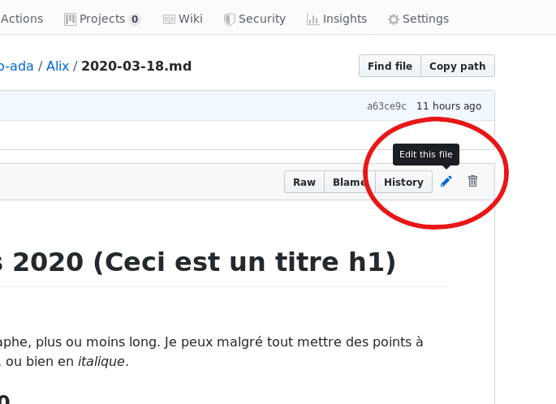

# Journal d'apprentissage

- [Comment faire son journal ?](#comment-faire)
- [Quelle contenu dans mon journal ?](#quelle-contenu-dans-mon-journal)
- [Journal d'Alix](Alix/)
- [Journal d'Aycha](Aycha/)
- [Journal de Céline](Celine/)
- [Journal de Charlotte](Charlotte/)
- [Journal de Delphine](Delphine/)
- [Journal de Françoise](Francoise/)
- [Journal de Laura](Laura/)
- [Journal de Lynda](Lynda/)
- [Journal de Nassima](Nassima/)
- [Journal de Paloma](Paloma/)
- [Journal de Sarah](Sarah/)
- [Journal de Silvia](Silvia/)
- [Journal de Sophie](Sophie/)
- [Journal de Soraya](Soraya/)
- [Journal de Vanessa](Vanessa/)

## Comment faire

Nous vous proposons :
- d'écrire votre journal quotidien dans un format texte, si possible en [markdown](https://fr.wikipedia.org/wiki/Markdown) (le [cours markdown d'OpenClassRoom](https://openclassrooms.com/fr/courses/1304236-redigez-en-markdown));
- sur un dépot [github/descodeuses/journal-promo-ada](https://github.com/descodeuses/journal-promo-ada)
- le contenu est publié sur [descodeuses.github.io/journal-promo-ada/](https://descodeuses.github.io/journal-promo-ada/)

Un fichier exemple est placé dans chacun de vos répertoires pour vous aider, vous servir de référence.
Si vous avez des difficultés, prévenez nous tout de suite ! nous sommes là ! pour vous !

Pour écrire votre journal, il y a plusieurs méthode.

### Dans github directement

- aller sur [github.com/descodeuses/journal-promo-ada/tree/master/promo-ada](https://github.com/descodeuses/journal-promo-ada/tree/master/promo-ada)
- clicker sur le répertoire qui porte votre prénom
- pour ajouter un fichier (cas habituel pour ajouter le fichier du jour) : appuyer sur le bouton « create new file »



- choisir le nom du fichier en YYYY-MM-DD.md (par exemple 2020-03-22.md)



- Ajouter le titre et faite votre journal (sous forme de liste ou comme vous voulez)

```
# Mon journal du 22 mars 2020

- ma super activité,
- un autre truc

ou un paragraphe
```




- une fois terminé, vous pouvez aller en bas de la page et clicker sur le bouton « commit »



That's all !

Dans le cas d'un fichier existant sur lequel vous voulez apporter des modifications.

- cliquer sur le fichier à modifier



- appuyer sur l'icône crayon en haut à droite du fichier



- procéder aux modifications et ajout dans le fichier
- une fois terminé, en bas de la page, et commit.

### Avec mon éditeur de code

### En ligne de commande avec GIT (Git bash pour windows)

Pour démarrer `git clone git@github.com:descodeuses/promo-ada-journaux.git`. Une fois réalisé une fois, cette opération n'est plus nécessaire.

Le reste de la procédure sera celle que vous executerez chaque fois.

- `git pull` récupération des dernières modification
- _je créé un fichier dans mon répertoire, à la date du jour_
- _j'écris des phrases dans mon journal_
- `git add promo-ada/_mon-nom_` ajout de mon fichier sur « scène » pour préparer mon commit (je place mon fichier sur _stage_).
- `git commit -m "journalise la journée du  jj/mm/aaaa"` commit en mettant un petit message de mon choix. Rappel, c'est bien de commencer par un verbe.
- `git push origin master` publication de mes modifications sur le github pour que tout le monde puisse les voires.


## Quelle contenu dans mon journal ?

La question qui dois vous animer au moment d'écrire dans votre journal est **qu'est-ce que j'ai appris aujourd'hui ?**.

Chaque action découverte, explorée, esssayée, est importante. **Il n'y a pas de petit apprentissage**.

Écrivez tout ce que vous voulez :

- des commandes utiles
- des nouveaux outils  (mettez les liens vers la page de l'outil)
- une ou plusieurs lignes de code que vous trouvez vraiment chouette
- une ou plusieurs lignes de code que vous ne comprenez pas
- une copie d'écran d'une de vos page web qui n'est pas jolie
- une copie d'écran d'une de vos pages web qui est vraiment très chouette
- une astuce
- un cours
- un tuto
- une chaine youtube
- une video
- un exercice
- une question
- une reflexion
- ...

sous la forme que vous voulez

- une liste de mots, de liens
- des paragraphes de textes
- des photos de notes (attention à l'insertion d'image dans markdown ;-))
- un dessin (idem que pour les photos)
- du code
- ...

